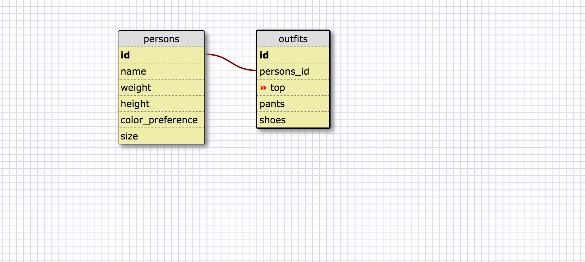

1. SELECT * FROM states; 
2.SELECT * FROM regions;
3. SELECT population,state_name FROM states;
4.SELECT state_name,population FROM states ORDER BY population DESC;
5.SELECT state_name FROM states WHERE region_id = 7;
6.SELECT state_name,population_density FROM states WHERE population_density > 50 ORDER BY population_density ASC;
7.SELECT state_name FROM states WHERE population BETWEEN 1000000 AND 1500000;
8.SELECT state_name , region_id FROM states ORDER BY region_id ASC;
9. SELECT region_name FROM regions WHERE region_name LIKE "%CENTRAL";
10. SELECT region_name, state_name FROM regions JOIN states ORDER BY region_id ASC;

What are databases for?
A database is a collection of information organized  to provide efficient retrieval
What is a one-to-many relationship?
one to many is a one type of relation with many 
What is a primary key? What is a foreign key? How can you determine which is which?
a foreign key is th one you can connect from the ID
