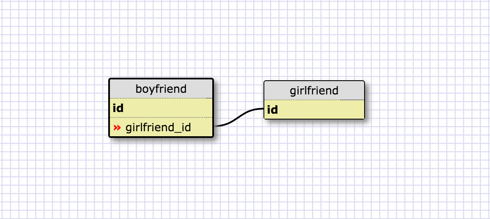
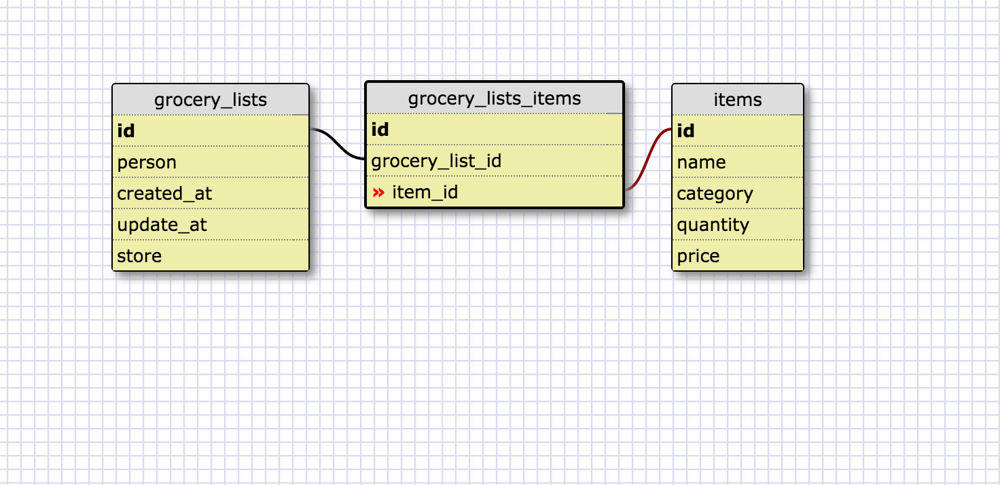

What is a one-to-one database?
One to one it's the relation betweem two tables,
When would you use a one-to-one database? (Think generally, not in terms of the example you created).
if you one person like let's see you want to create a table for a boyfriend and girlfriend since it's only a one-to-one
What is a many-to-many database?
when you have several tables and you can connect them all
When would you use a many-to-many database? (Think generally, not in terms of the example you created).
if you have an art work and you need to have it how rooms you can put and the authors that is the perfect reason to have a many-to many
What is confusing about database schemas? What makes sense?
At first it was confusing but then when I was done it all made sense.

